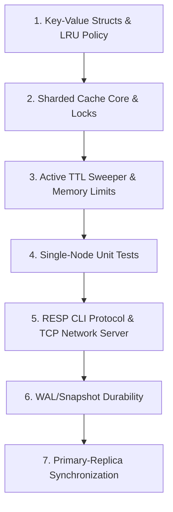

# Beginner's Guide to Building a Multithreaded Cache Engine

Hi there! Welcome to your cache project. Since you are building this for an interview and are new to systems programming, this guide is written specifically for you. We will break down exactly what we are building, why it works, and how the components fit together.

---

## 1. What is an In-Memory Cache?

Imagine you are running a library. 
* If a student asks for a book, you have to walk all the way to the back archives (the **Disk Database**), search the shelves, and bring it back. This takes **minutes**.
* If 100 students ask for the *same* book, walking to the archives 100 times is extremely slow.
* Instead, you place a small table next to your front desk. When you retrieve the book the first time, you leave it on this table (the **In-Memory Cache**). The next 99 students get it **instantly**.

A cache is a high-speed data storage layer which stores a subset of data (typically transient) so that future requests for that data are served faster than is possible by accessing the primary storage database.

---

## 2. System Architecture Visual

Below is the conceptual structure of the cache engine we are building.

---

## 3. Core Concepts Explained with Simple Analogies

### Concept A: Multithreading & Sharding (The Checkout Line Analogy)
If your cache has only one map and one lock, it is like a store with only **one cash register**. Even if you hire 10 cashiers (threads), they all have to take turns using the *same* cash register. This causes massive bottlenecks (lock contention).

* **Our Solution (Sharding)**: We split the store into 64 separate register lanes (Shards). 
* When a client requests a key (e.g., `"user:12"`), we run a fast hash calculation on that key to determine which lane it belongs to.
* This means thread A can modify a key in Shard 3, while thread B reads a key in Shard 5 at the exact same time without waiting!

### Concept B: Time-To-Live / TTL (The Milk Expiry Analogy)
Data should not live forever. If a client sets a key with a TTL (e.g., 5 seconds), it means the data has an expiration date.
* **Lazy Expiration**: If a client requests a key, we check: *"Is the current time past the expiration date?"* If yes, we delete the key right then and return "not found".
* **Active Sweep**: What if a key is never requested again? It will sit in memory forever. To prevent this leak, a background worker thread wakes up periodically, randomly selects a few shards, and sweeps away expired items.

### Concept C: Eviction & Memory Limits (The Desk Analogy)
Your server has a maximum memory limit (e.g., 100 Megabytes). This is like your desk space.
* If your desk gets full, and you need to put a new document down, you must throw away an old document first.
* **LRU (Least Recently Used)**: We throw away the document that hasn't been touched for the longest time. Every time we read or write a key, we move it to the front of our list. The items at the back of the list are the ones we evict when we hit the memory limit.

### Concept D: Durability (The Ledger Analogy)
In-memory caches are fast because RAM is volatile. If the power goes out, all your cache data disappears. We need durability:
1. **Snapshotting (RDB)**: Every few minutes, we save the entire state of the cache to a binary file on disk. This is like printing a complete catalog statement of your library at 5:00 PM.
2. **Append-Only Log / WAL (AOF)**: Every time a write command occurs (like `SET` or `DEL`), we append it to a log file on disk. This is like writing down every single transaction in a ledger notebook as it happens. 
* If the server crashes, we recover by loading the last catalog statement (snapshot) and replaying the subsequent transactions from the ledger (WAL).

---

## 4. Where Do We Start?

Do not try to build the whole system at once. We will follow a step-by-step path:

1. **Step 1: The Core Entry**: Create a simple C++ structure to hold your data (value, expiry timestamp, usage stats).
2. **Step 2: LRU Eviction**: Build a class that tracks which keys are used least recently.
3. **Step 3: The Sharded Store**: Build the sharded hash maps and write reader-writer locks (`std::shared_mutex`) around each shard.
4. **Step 4: Background Workers**: Create the background thread that sweeps expired keys.

*Head over to [phase_1_instructions.md](file:///d:/cpp_multithreaded_cache_engine/outputes/phase_1_instructions.md) in this folder to start writing your first header file!*
