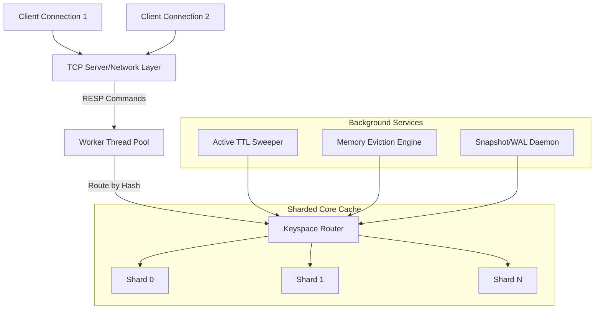

# Redis-like Multithreaded In-Memory Cache Engine: Project Overview

This document outlines the architectural blueprint, design choices, concurrency model, and project structure for the Redis-like, multithreaded, in-memory cache engine in C++.

---

## 1. High-Level Architecture & Modules

The cache engine is designed using a **sharded, boss-worker, event-driven** pattern to handle high-throughput, low-latency concurrent operations with minimal lock contention.



---

## 2. Key Architecture Components

### A. Sharded Core (`Shard`)
To avoid a global lock on the entire cache, the keyspace is partitioned into a fixed number of shards (e.g., 64 or 128 shards). 
- **Hashing**: A consistent hashing or simple modulo hashing algorithm determines which shard owns a key:
  $$\text{Shard ID} = \text{Hash}(key) \pmod{\text{Total Shards}}$$
- **Locks**: Each Shard has its own `std::shared_mutex` (reader-writer lock). Reading keys uses a shared lock (`std::shared_lock`); writing/modifying keys uses an exclusive lock (`std::unique_lock`).
- **Data Structures per Shard**:
  1. `std::unordered_map<std::string, CacheEntry>`: The primary key-value storage.
  2. **LRU / Eviction List**: A doubly-linked list (`std::list` or custom intrusive list) storing key usage. An entry is moved to the front on read/write.
  3. **TTL Index**: A priority queue or min-heap (`std::multimap<uint64_t, std::string>`) mapping expiration timestamp to keys for efficient cleanup.

### B. Networking & Protocol (`RESP`)
- **Protocol**: Fully/partially compliant RESP (Redis Serialization Protocol) parser. This allows testing via the official `redis-cli`.
- **Boss-Worker Model**:
  - **Boss Thread**: Listens for incoming connections, accepts them, and registers them to an event loop or adds them to a thread-safe connection queue.
  - **Worker Thread Pool**: Picks up client connections, reads the raw socket bytes, parses RESP arrays, executes commands, and writes RESP responses.

### C. Durability (`Snapshot` & `WAL`)
- **Snapshot (RDB style)**: Point-in-time binary dumps. To prevent stalling client requests during writes, we run snapshots asynchronously. In C++, this can use a background thread copying or traversing elements, or relying on OS-level fork-based copy-on-write if on Linux. For cross-platform reliability, we'll design an iterator-based snapshot mechanism that locks shards briefly one-by-one to dump their state.
- **Write-Ahead Log (WAL/AOF style)**: Every mutating command (SET, DEL, EXPIRE) is serialized and appended to an active WAL file. We can configure sync policies: `always`, `every_sec`, or `no` (delegated to OS).

### D. Pluggable Serialization
- Values are stored as serialized payloads along with a content-type tag.
- A `Serializer` interface enables seamless support for `Raw String`, `JSON`, or `Protobuf` formats without modifying the cache core.

---

## 3. Proposed Directory Structure

Below is the directory structure we will set up for this project.

```
cpp_multithreaded_cache_engine/
├── CMakeLists.txt
├── outputes/
│   ├── overview.md                  (This document)
│   └── phase_1_instructions.md       (Phase 1 directives)
├── include/
│   ├── cache/
│   │   ├── cache_engine.hpp         (Orchestrates shards, background threads)
│   │   ├── shard.hpp                (Per-shard lock, hashmap, and indices)
│   │   ├── entry.hpp                (Value metadata: version, TTL, last access)
│   │   ├── eviction_policy.hpp      (Pluggable LRU/LFU interface)
│   │   └── serializer.hpp           (Pluggable serialization interface)
│   ├── network/
│   │   ├── tcp_server.hpp           (Boss-worker multi-threaded socket server)
│   │   └── resp_parser.hpp          (RESP parsing and builder utilities)
│   ├── durability/
│   │   ├── snapshot_manager.hpp     (Binary snapshot writing and recovery)
│   │   └── wal_logger.hpp           (Append-only transaction logger)
│   └── replication/
│       ├── replication_manager.hpp  (Primary-replica sync stream)
│       └── connection.hpp           (Helper wrappers for replication socket streams)
├── src/
│   ├── cache/
│   │   ├── cache_engine.cpp
│   │   ├── shard.cpp
│   │   └── eviction_policy.cpp
│   ├── network/
│   │   ├── tcp_server.cpp
│   │   └── resp_parser.cpp
│   ├── durability/
│   │   ├── snapshot_manager.cpp
│   │   └── wal_logger.cpp
│   └── main.cpp                     (Application main entrypoint)
├── tests/
│   ├── unit/
│   │   ├── test_cache_core.cpp      (Basic gets, sets, eviction, TTL)
│   │   └── test_resp.cpp            (RESP parser validations)
│   └── integration/
│       └── test_concurrency.cpp     (Heavy parallel write/read stress testing)
└── README.md
```

---

## 4. Multi-Phase Implementation Plan

We will proceed in 4 execution phases:

### Phase 1: Core Cache Engine & Concurrency
- Implement `CacheEntry`, `EvictionPolicy` (LRU), and `Shard`.
- Implement `CacheEngine` to manage multiple shards and key routing.
- Add active and lazy TTL expiration.
- Add memory accounting (tracking size of keys/values) and threshold-triggered evictions.
- Write robust unit tests validating concurrent access to different shards.

### Phase 2: RESP Protocol & Multi-threaded Server
- Build a lightweight, state-machine-based RESP parser.
- Build a cross-platform (Winsock on Windows, POSIX on Unix) TCP Server with connection handling.
- Combine the parser and server to handle CLI commands: `GET`, `SET`, `DEL`, `EXPIRE`, `TTL`, `PING`.

### Phase 3: Durability (WAL and Snapshots)
- Implement `SnapshotManager` to write state to disk with minimal shard locking.
- Implement `WalLogger` to stream mutating commands asynchronously or synchronously.
- Implement recovery on startup (reading snapshot first, then replaying WAL).

### Phase 4: Replication & Hardening
- Primary replication controller sending transactions to registered replicas.
- Replica node setup capable of initial full sync and catch-up stream.
- Metrics tracking (hit rate, ops/sec, memory distribution) and admin commands (`INFO`).

---

> [!NOTE]
> All subsequent logs, implementation designs, and results will be saved under the `outputes/` folder to keep your workspace clean and organized.
