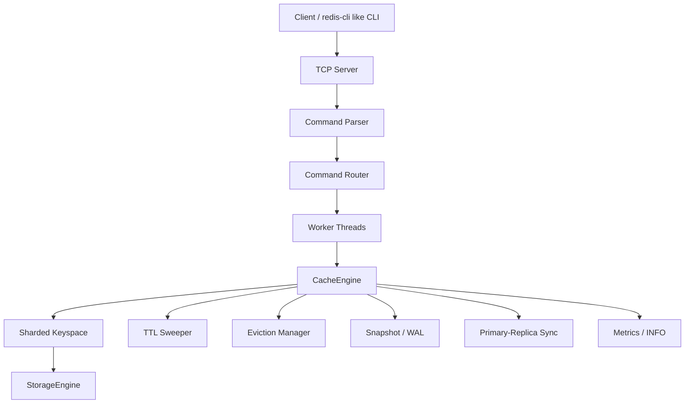

# System Design: C++ Multithreaded Cache Engine

This document describes the intended end-to-end design of the application using the project plan as the reference.

## 1. Goal

Build a Redis-like in-memory cache engine in C++ that supports:

- `GET`, `SET`, `DEL`, `EXPIRE`, `TTL`, `MGET`, `MSET`, `INFO`, `SAVE`
- multithreaded request handling
- TTL and eviction
- memory limits
- metrics and observability
- persistence
- replication
- pluggable serialization

The current codebase is only the starting skeleton, but the final system is designed as a layered cache server with clear separation between network, command execution, storage, and background maintenance.

## 2. High-Level Architecture



## 3. Core Layers

### 3.1 Network Layer

Responsibility:

- accept client connections
- read commands
- parse request frames
- write responses

Design:

- cross-platform sockets: WinSock on Windows, POSIX sockets on Unix
- boss-worker model
- non-blocking or bounded blocking request handling
- connection queue and worker pool for burst traffic

### 3.2 Command Layer

Responsibility:

- convert protocol input into internal commands
- validate arguments
- map commands to engine operations

Example commands:

- `SET key value`
- `GET key`
- `DEL key`
- `EXPIRE key seconds`
- `TTL key`
- `MSET k1 v1 k2 v2`
- `MGET k1 k2`

### 3.3 Cache Layer

`CacheEngine` is the orchestration layer.

Responsibilities:

- route keys to shards
- coordinate reads/writes
- enforce memory policy
- trigger TTL cleanup
- connect persistence and replication hooks
- expose admin/metrics APIs

### 3.4 Storage Layer

`StorageEngine` is the data holder.

In the current skeleton, `StorageEngine` owns the `unordered_map` and stores entries. The reason `CacheEngine` and `StorageEngine` look similar is that they are separated by responsibility:

- `StorageEngine`: raw storage mechanics
- `CacheEngine`: system orchestration and policy control

This lets the cache layer evolve without rewriting the storage core.

## 4. Data Model

### Entry

Each record should eventually store:

- key
- value
- expiration timestamp
- last access time
- version
- flags

Current code only has:

- `Entry.value`

but the final design should extend it with metadata for TTL, eviction, and replication.

## 5. Sharding Model

The keyspace is split into fixed shards.

Why:

- reduces lock contention
- allows parallel access
- keeps latency stable under burst load

Routing:

```text
shard_id = hash(key) % shard_count
```

Each shard owns:

- key-value map
- TTL index
- eviction metadata
- shard-level mutex/shared_mutex

## 6. Concurrency Model

### Read path

1. accept request
2. route key to shard
3. acquire shared/read lock
4. check data and expiry
5. return response

### Write path

1. accept request
2. route key to shard
3. acquire exclusive/write lock
4. update storage
5. update TTL and eviction metadata
6. persist/log if enabled

### Multi-key operations

For `MGET`, `MSET`, and other multi-key commands:

- sort shard IDs first
- lock in deterministic order
- release in reverse order

This prevents deadlocks.

## 7. TTL Design

Two TTL strategies should be used:

- **Lazy expiration**: check expiry during reads/writes
- **Active sweeping**: background thread periodically removes expired keys

Why both:

- lazy cleanup handles hot keys
- active cleanup prevents memory buildup for cold keys

## 8. Eviction Design

Primary policy: **LRU**

Why:

- predictable
- easy to reason about
- good default for mixed workload bursts

How:

- track recent access order
- when memory limit is crossed, evict least recently used keys

Future extension:

- LFU can be added behind a policy interface later

## 9. Memory Management

The engine should enforce a configurable memory ceiling.

Mechanism:

- track approximate per-entry memory cost
- maintain total memory usage counter
- trigger eviction when high watermark is reached
- continue eviction until low watermark or safe threshold

## 10. Persistence

Two persistence mechanisms are planned:

### Snapshot

- point-in-time dump of memory state
- used for startup recovery

### WAL / AOF

- append every mutating command
- replay after snapshot load
- improves recovery point objective

Recovery order:

1. load latest snapshot
2. replay WAL tail
3. restore latest consistent state

## 11. Replication

Primary-replica async replication is the first target.

Flow:

- primary records mutations
- replicas subscribe to stream
- initial full sync copies current state
- incremental stream catches up afterwards

Metrics:

- replication lag
- sync status
- last applied sequence

## 12. Metrics and Observability

The system should expose:

- hits / misses
- ops/sec
- latency percentiles
- memory usage
- eviction count
- TTL expirations
- queue depth
- worker utilization

An `INFO` command should return runtime health details.

## 13. Current Code Interpretation

Current files:

- `src/cache/CacheEngine.h`
- `src/storage/StorageEngine.h`
- `src/storage/Entry.h`

Current meaning:

- `Entry` is the record model
- `StorageEngine` holds the map
- `CacheEngine` is the top-level wrapper

So the repeated `set/get/erase` API is intentional layering, not accidental duplication.

## 14. Recommended Final Module Split

```text
src/
  cache/
    CacheEngine.h / .cpp
    Shard.h / .cpp
    EvictionPolicy.h / .cpp
  storage/
    StorageEngine.h / .cpp
    Entry.h
  ttl/
    TtlManager.h / .cpp
  eviction/
    LruPolicy.h / .cpp
  persistence/
    SnapshotManager.h / .cpp
    WalLogger.h / .cpp
  replication/
    ReplicationManager.h / .cpp
  server/
    TcpServer.h / .cpp
    CommandParser.h / .cpp
```

## 15. Execution Phases

1. Build the single-node core with sharding, TTL, and LRU.
2. Add networking and command parsing.
3. Add persistence with snapshot + WAL.
4. Add replication.
5. Add metrics, hardening, and benchmark tuning.

## 16. Conclusion

The application is designed as a layered, multithreaded cache platform with `CacheEngine` as the control plane and `StorageEngine` as the data plane. The separation exists so future features like sharding, TTL, eviction, persistence, and replication can be added without breaking the storage core.
